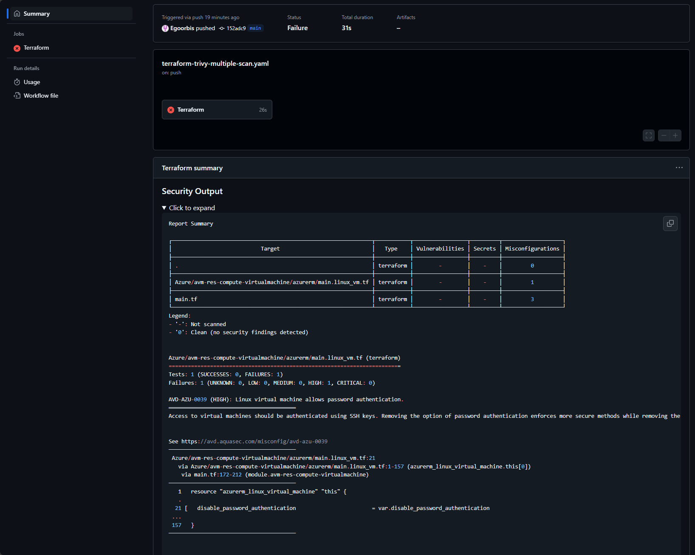

## Introduction

Trivy<sup>[1](#sources)</sup> is a verstatile and comprehensive open-source security scanner. It's designed to be fast, easy to use and adaptable to various environments. Here's a breakdown of what it does:

What Trivy Scans

* Container Images: Trivy excels at finding vulnerabilities within container images by analyzing the software packages and dependencies inside.  
* File Systems: It can scan your local file system for security issues.  
* Git Repositories: Trivy can directly scan your code repositories (like GitHub) for vulnerabilities.  
* Cloud Environments: It can scan cloud platforms like AWS for misconfigurations.
* Infrastructure as Code (IaC): This is what this blog post focuses on! Trivy can analyze your IaC configurations for misconfigurations that could lead to security weaknesses.  

Why Trivy is Popular:

* Simple to Use: Trivy has a straightforward command-line interface and integrates easily into CI/CD pipelines.  
* Comprehensive: It has a large database of known vulnerabilities that is constantly updated.
* Fast: Trivy is designed for speed and efficiency, minimizing the impact on your workflows.  
* Flexible: It can be used in various ways, from a standalone tool to a part of your CI/CD.

How Trivy Helps:

* Early Detection: By integrating Trivy into your development process, you can find and fix vulnerabilities before they reach production.  
* Reduced Risk: Proactively addressing vulnerabilities minimizes the chance of security breaches.  
* Improved Security Posture: Regular scanning with Trivy helps you maintain a strong security stance.

So if you're working with containers, IaC, or any of the targets mentioned above, Trivy is definitely a tool worth exploring.

Enough of the talking, let's dig deeper on how to use Tricy as part of your CI/CD process by scanning your Terraform deployments for security risks, before actually deploying the configuration to ensure that there are no vulnerabilities or misconfigurations that could potentially open up security risks.

# Prerequisites

You need to have an exisitng connection between your GitHub repository and Azure.
If you haven't done this yet, you can follow my previous blog post on how to setup OIDC and Entra ID authentication to deploy to Azure from GitHub Actions.
You can find all the details in my previous blog post [here](https://egoorbis.github.io/2024/2025-01-31-terraform-azure-deployment)

The files for this posts are available in my blog-data repository
* Terraform Code (https://github.com/Egoorbis/blog-data/tree/main/aks_byocni_cilium)
* GitHub Actions Workflow (https://github.com/Egoorbis/blog-data/blob/main/.github/workflows/terraform-trivy-scan.yaml)

# GitHub Actions Setup

The first step is to create a new GitHub Actions workflow that will scan your Terraform code using Trivy. This workflow will run every time you push changes to your repository, ensuring that your code is always scanned by Trivy.
If not existing create the `.github/workflows` directory and store the following yaml file.

This is a basic GitHub Action workflow that deploys terraform code to Azure. The workflow is triggered on every push to the main branch of the repository. It sets up the necessary environment variables and runs the Terraform commands to deploy the infrastructure.

NOTE: Make sure to replace the environment variables with your own values, if they are different from mine.


```yaml
name: "Secure Your Terraform with Trivy in GitHub Actions"

on:
  push:
    branches:
      - main

permissions:
  contents: read
  id-token: write

jobs:
  terraform:
    name: "Terraform"
    runs-on: ubuntu-latest
    defaults:
      run:
        shell: bash
        working-directory: ${{ env.TERRAFORM_DIR }}
    env:
      TERRAFORM_DIR: aks_byocni_cilium
      TERRAFORM_LOG: "WARN"
      ARM_CLIENT_ID: ${{ secrets.AZURE_CLIENT_ID }}
      ARM_SUBSCRIPTION_ID: ${{ secrets.AZURE_SUBSCRIPTION_ID }}
      ARM_TENANT_ID: ${{ secrets.AZURE_TENANT_ID }}
      BACKEND_RESOURCE_GROUP: ${{ secrets.BACKEND_RESOURCE_GROUP }}
      BACKEND_STORAGE_ACCOUNT: ${{ secrets.BACKEND_STORAGE_ACCOUNT }}
      BACKEND_CONTAINER_NAME: ${{ secrets.BACKEND_CONTAINER_NAME }}
      BACKEND_KEY: ${{ secrets.BACKEND_KEY }}

    steps:
      - name: "Code Checkout"
        uses: actions/checkout@v4

      - name: "Install Terraform"
        uses: hashicorp/setup-terraform@v3

      - name: "Terraform Version"
        id: version
        run: terraform --version

      - name: "Terraform Init"
        id: init
        run: |
          terraform init \
            -backend-config="resource_group_name=$BACKEND_RESOURCE_GROUP" \
            -backend-config="storage_account_name=$BACKEND_STORAGE_ACCOUNT" \
            -backend-config="container_name=$BACKEND_CONTAINER_NAME" \
            -backend-config="key=$BACKEND_KEY" \

      - name: "Terraform Plan"
        id: plan
        run: |
          terraform plan -out=tfplan

      - name: "Upload Terraform Plan to Working Directory"
        uses: actions/upload-artifact@v4
        with:
          name: terraformPlan
          path: "tfplan"

      - name: "Terraform Apply using Plan File"
        id: apply
        run: terraform apply tfplan
```

## Integrate Trivy Scan into the Workflow

The next step is to integrate Trivy into the workflow. This can be done by using the [aquasecurity/trivy-action](https://github.com/aquasecurity/trivy-action) GitHub Actions.

There are two options to integrate Trivy into your workflow:
* Either we scan the Terraform directory directly after the Terraform code has been checked out.
* Or we scan the Terraform plan file that was generated by the Terraform plan command.

I'll demonstrate both options below.

### Option 1: Scan Terraform Directory

First lets' look at the options that trivy provides for scanning IaC configurations. I suggest to play around with the options to see what fits best for your use case.
Trivy allows to specify options directly in the pipeline or by using a yaml file stored in the repository. I'll show you how to use the options directly in the pipeline.
Check the trivy action documentation for further details on the options that can be used.

Below is an basic example of how to integrate Trivy into the GitHub Actions workflow to scan the Terraform directory directly during the pipeline run.

* scan-type: specifies which scan type - 'fs' runs a filesystem scan, we use scanners to specify which security issues should be detected. We can also set scan-type to 'config' which is a subcommand of 'fs' and only scans for misconfiguration issues.
* scanners: is used to scan for the desired security issues
* format: is used to specify how the scan results are displayed.
* exit-code: is used to specify if we want to fail the workflow if vulnerabilities are found.
* severity: is used to specify the severity we want to check for
* skip-dirs: is used to skip directories we don't want to scan.
* trivyignores: is used to specify a *.trivyignore file that contains the vulnerabilities to ignore.

```yaml
 - name: Run Trivy IaC scan
        uses: aquasecurity/trivy-action@0.29.0
        with:
          scan-type: 'fs'
          scanners: vuln,secret,misconfig
          format: 'table'
          exit-code: '1'
          severity: 'CRITICAL,HIGH'
          skip-dirs: '.terraform'
          trivyignores: ${{ env.TERRAFORM_DIR }}/.trivyignore
```


We can add this step right after our Code Checkout step in the workflow. This will ensure that the Terraform code is scanned by Trivy before the Terraform commands are executed.
To check what happend, we need to have a look at the output of the step, which looks like this:


We can see that there are two issues related to our code, but the result is not jet very nice.


We can also run Trivy multiple times, as example to publish the results of a scan to the GitHub Summary showing all security issues found in the Terraform code and then fail the workflow if the results include any High or Critical vulnerabilities.

This can be achieved by changing the code e. g. as follows:

```yaml
      - name: Run Initial Trivy IaC scan
        uses: aquasecurity/trivy-action@master
        with:
          scan-type: 'fs'
          scanners: vuln,secret,misconfig
          format: 'table'
          skip-dirs: '.terraform'
          trivyignores: ${{ env.TERRAFORM_DIR }}/.trivyignore
          hide-progress: true
          output: $GITHUB_WORKSPACE/trivy.txt

      - name: Publish Trivy Output to Summary
        run: |
          if [[ -s $GITHUB_WORKSPACE/trivy.txt ]]; then
            {
              echo "### Security Output"
              echo "<details><summary>Click to expand</summary>"
              echo ""
              echo '```terraform'
              cat $GITHUB_WORKSPACE/trivy.txt
              echo '```'
              echo "</details>"
            } >> $GITHUB_STEP_SUMMARY
          fi        

      - name: Run High, Critical Trivy IaC scan
        uses: aquasecurity/trivy-action@master
        with:
          scan-type: 'fs'
          scanners: vuln,secret,misconfig
          hide-progress: true
          severity: 'CRITICAL,HIGH'
          exit-code: '1'
          skip-dirs: '.terraform'
          trivyignores: ${{ env.TERRAFORM_DIR }}/.trivyignore
          skip-setup-trivy: true
```

This creates an already better looking output to our workflow summary page.



### Option 2: Scan Terraform Plan File

## Using .trivyignore file

In the code above we already added `trivyignores: ${{ env.TERRAFORM_DIR }}/.trivyignore` to the Trivy action. This allows us to willingly exclude some security issues. 

As example for the 


## Sources

1. [Trivy GitHub Repository](https://github.com/aquasecurity/trivy)

For further details I recommend the following sources:
https://trivy.dev/v0.34/
https://www.aquasec.com/blog/devsecops-with-trivy-github-actions/
